## ΤΕΧΝΟΛΟΓΙΕΣ ΕΦΑΡΜΟΓΩΝ ΔΙΑΔΙΚΤΥΟΥ ΕΡΓΑΣΙΑ ΕΑΡΙΝΟΥ ΕΞΑΜΗΝΟΥ 2021

## Εφαρμογή Επαγγελματικής Δικτύωσης (τύπου LinkedIn)

### Team  
-[gianniskp](https://github.com/giannhskp)
-[sitaras](https://github.com/Sitaras)

### Γενικά Σχόλια

- Για το back-end χρησιμοποιήσαμε Spring Boot.
- Για το front-end χρησιμοποιήσαμε Angular 5.
- Για την βάση δεδομένων χρησιμοποιήσαμε MySQL.
- Όλες οι αιτήσεις γίνονται χρησιμοποιώντας το πρωτόκολλο SSL/TLS. Στον φάκελο resources του back-end υπάρχει και το αντίστοιχο self-signed certificate (Java KeyStore file).
- Ο server (back-end) δέχεται αιτήσεις στο port 8443 (λόγω του ssl).
- Για να “τρέξει” το front-end εκτελούμε την εντολή: **ng serve --ssl true** έτσι ώστε να μπορούμε να χρησιμοποιήσουμε το πρωτόκολλο ssl/tls. Συνδεόμαστε στην εφαρμογή μέσω του browser στην διεύθυνση: **[https://localhost:4200**](https://localhost:4200)**

Πριν την πρώτη εκτέλεση του front-end χρειάζεται να εκτελεστεί η εντολή npm install έτσι ώστε να εγκατασταθούν όλα τα node-modules που χρησιμοποιούνται.

- **ΣΗΜΑΝΤΙΚΗ ΠΑΡΑΤΗΡΗΣΗ**: Λόγω του self-signed certificate, ενδεχομένως να χρειαστεί να πραγματοποιηθούν οι ακόλουθες δύο ενέργειες χωρίς τις οποίες ίσως να μην λειτουργεί η εφαρμογή:

- Κατά την πρόσβασή στην διεύθυνση **[https://localhost:4200**](https://localhost:4200)**, ενδεχομένως ο browser να προβάλει κάποια ειδοποίηση ασφαλείας την οποία και πρέπει να προσπεράσουμε πατώντας να συνεχίσουμε.
- Ανάλογα με τον browser που χρησιμοποιούμε ενδεχομένως να χρειαστεί να επιτρέψουμε εκ των προτέρων τα self-signed certificates. Διαφορετικά, για λόγους ασφαλείας η εφαρμογή ενδεχομένως να μην είναι λειτουργική.

Για παράδειγμα, σε Google Chrome, μπορούμε να επιτρέψουμε τα self-signed certificates πατώντας στο search bar :

chrome://flags/#allow-insecure-localhost

και ενεργοποιώντας την πρώτη επιλογή που εμφανίζεται.

- Για την διαχείριση/αποθήκευση των κωδικών πρόσβασης χρησιμοποιούμε κρυπτογράφηση μέσω του PasswordEncoder του spring security.
- Για το authentication ενός χρήστη κατα την σύνδεση του χρησιμοποιούμε τον Authentication Manager του spring security.
- Οι αιτήσεις έπειτα από την σύνδεση ενός χρήστη περιέχουν ένα JSON Web Token το οποίο ο χρήστης λαμβάνει κατα την σύνδεσή του και το οποίο ανανεώνεται κάθε φορά που λήγει. Μέσω του token ο χρήστης μπορεί να έχει πρόσβαση σε όλες τις προστατευόμενες καρτέλες της εφαρμογής στις οποίες δεν μπορεί να έχει πρόσβαση ένας μη συνδεδεμένος χρήστης.
- Ένας μη συνδεδεμένος χρήστης έχει πρόσβαση μόνο στο Welcome Page και αντίστοιχα στις καρτέλες σύνδεσης/εγγραφής. Κάθε προσπάθεια για αίτημα ενός μη συνδεδεμένου χρήστη σε οποιαδήποτε άλλη διεύθυνση απορρίπτεται..

### Welcome Page

Ανοίγοντας την αρχική σελίδα, στα δεξιά φαίνεται το λογότυπο της ιστοσελίδας καθώς και ένα μήνυμα καλωσορίσματος. Επίσης, μέσω του header της σελίδας, δίνεται στον χρήστη η δυνατότητα να εγγραφεί στην ιστοσελίδα δημιουργώντας έναν νέο λογαριασμό είτε να συνδεθεί με έναν ήδη υπάρχον λογαριασμό. Όλες οι αιτήσεις γίνονται μέσω του πρωτοκόλλου  SSL/TLS, περισσότερες λεπτομέρειες εξηγούνται στην συνέχεια.

Η “εικόνα” που συναντά ο χρήστης ανοίγοντας την σελίδα καλωσορίσματος είναι η εξής:

### Εγγραφή χρήστη

Πατώντας το κουμπί sign up, ο χρήστης μπορεί να δημιουργήσει έναν νέο λογαριασμό. Για την δημιουργία ενός νέου λογαριασμού απαιτείται η εισαγωγή ηλεκτρονικής διεύθυνσης email, όνομα χρήστη (username), κωδικός, επιβεβαίωση του κωδικού, όνομα, επώνυμο και φωτογραφία προφίλ. Το όνομα χρήστη καθώς και το email πρέπει να είναι μοναδικά, δηλαδή να μην υπάρχει ήδη κάποιος εγγεγραμμένος χρήστης με τα στοιχεία αυτά, διαφορετικά εμφανίζεται το αντίστοιχο μήνυμα λάθους. Η εισαγωγή φωτογραφίας προφίλ είναι προεραιτική κατα την εγγραφή, καθώς ο χρήστης μπορεί να την προσθέσει/αλλάξει και έπειτα από την εγγραφή του.

Σε κάθε περίπτωση επιτυχίας/αποτυχίας εγγραφής του χρήστη εμφανίζεται και το αντίστοιχο μήνυμα επιτυχίας/αποτυχίας.

Έπειτα από την επιτυχή εγγραφή ενός χρήστη, γίνεται ανακατεύθυνση στην σελίδα συνδεσης (login) έτσι ώστε να συνδεθεί.

Η εικόνα που συναντά ο χρήστης κατα την εγγραφή του είναι η εξής:

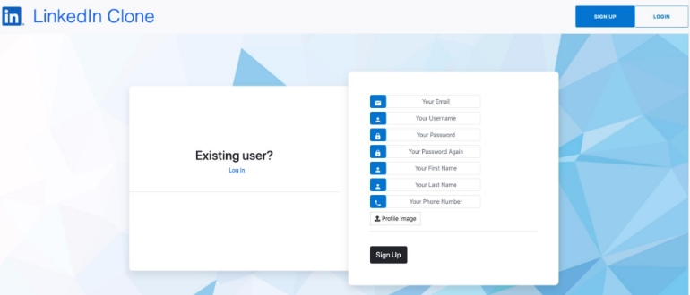

### Σύνδεση χρήστη

Για την σύνδεση ενός χρήστη, απαιτείται η εισαγωγή του email και του κωδικού του. Σε περίπτωση που εκχωρηθούν σωστά τότε ο χρήστης συνδέεται και ανακατευθύνεται στην αρχική σελίδα. Διαφορετικά, εμφανίζεται το αντίστοιχο μήνυμα λάθους και ο χρήστης πρέπει να εκχωρήσει ξανά τα στοιχεία του για να συνδεθεί.

Για την διαχείριση/αποθήκευση των κωδικών πρόσβασης χρησιμοποιείται κρυπτογράφηση. Πιο συγκεκριμένα, χρησιμοποιείται ο PasswordEncoder του spring security. Για το authentication του χρήστη κατα την σύνδεση του χρησιμοποιούμε τον Authentication Manager που επίσης παρέχεται από την βιβλιοθήκη του spring security.

Αφού συνδεθεί επιτυχώς ένας χρήστης, μέσω της απάντησης στο αίτημα σύνδεσης λαμβάνει ένα token το οποίο και χρησιμοποιεί για τις υπόλοιπες αιτήσεις του έπειτα από την σύνδεση. Πιο συγκεκριμένα λαμβάνει ένα μοναδικό JSON Web Token και μόνο μέσω αυτού ένας χρήστης μπορεί να έχει πρόσβαση στις υπηρεσίες της σελίδας. Το token αυτό λήγει έπειτα από ένα χρονικό διάστημα. Εάν λήξει, και ο συνδεδεμένος χρήστης κάνει μια νέα αίτηση τότε το token ανανεώνεται. Η εικόνα που συναντά ο χρήστης στην σελίδα σύνδεσης είναι η εξής:

### Αρχική Σελίδα

Αφού ένας χρήστης συνδεθεί επιτυχώς, ανακατευθύνεται στην αρχική σελίδα.

Η εικόνα που συναντά ακολουθεί στην συνέχεια. Κάθε ένα από τα αριθμημένα στοιχεία περιγράφεται στην συνέχεια.

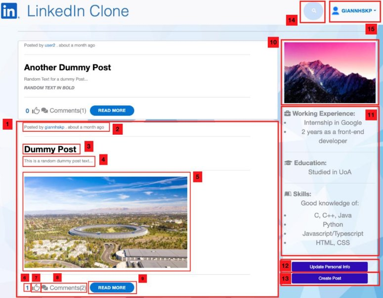

Στην αρχική σελίδα εμφανίζονται με χρονολογική σειρά άρθρα τα οποία είτε έχουν αναρτηθεί από τον ίδιο τον χρήστη, είτε από κάποιον χρήστη ο οποίος είναι συνδεδεμένος με αυτόν, είτε άρθρα στα οποία έχει δηλώσει το ενδιαφέρον του κάποιος χρήστης από το δίκτυο του τρέχοντος χρήστη.

1. Ένα άρθρο κάποιου χρήστη χρήστη.
1. Πληροφορίες για το ποιός ανέβασε το συγκεκριμένο άρθρο καθώς και για το χρονικό διάστημα το οποίο ανέβηκε. Πατώντας πάνω στο όνομα του “συγγραφέα” γίνεται ανακατεύθυνση στο προφίλ του.
1. Ο τίτλος του άρθρου.
1. Το κείμενο/περιεχόμενο του άρθρου.
1. Ένα άρθρο μπορεί να περιέχει και φωτογραφία ή βίντεο, όπως φαίνεται και από το συγκεκριμένο άρθρο το οποίο περιέχει μια φωτογραφία. Ωστόσο μπορεί να μην περιέχει και τίποτα από τα δύο όπως φαίνεται στο αμέσως επόμενο άρθρο.
1. Ο αριθμός των ατόμων που έχουν δηλώσει το ενδιαφέρον τους για το συγκεκριμένο άρθρο.
7. Μέσω αυτού του κουμπιού ο χρήστης μπορεί να δηλώσει το ενδιαφέρον του για το συγκεκριμένο άρθρο. Πατώντας το κουμπί, αλλάζει σε πράσινο χρώμα δείχνοντας ότι έχει δηλωθεί ενδιαφέρον για αυτό το άρθρο, και προφανώς αυξάνεται ο αριθμός των ατόμων που έχουν δηλώσει ενδιαφέρον για το άρθρο. Αν ξανά πατηθεί το κουμπί τότε επιστρέφει στο αρχικό του χρώμα και αφαιρείται η δήλωση του ενδιαφέροντος, μειώνοντας έτσι τον αριθμό δηλώσεων ενδιαφέροντος του άρθρου κατά ένα.

8. Πατώντας αυτό το κουμπί ο χρήστης μπορεί να δει τα ήδη υπάρχοντα σχόλια του άρθρου καθώς και να προσθέσει δικά του σχόλια.
8. Πατώντας αυτό το κουμπί ο χρήστης ανακατευθύνεται σε νέα σελίδα η οποία περιέχει μόνο το συγκεκριμένο άρθρο και τα σχόλια του. Μέσω αυτής της σελίδας μπορεί και να σχολιάσει το άρθρο.
8. Η φωτογραφία προφίλ του χρήστη.
8. Τα προσωπικά στοιχεία του χρήστη, όπως : επαγγελματική εμπειρία, εκπαίδευση και δεξιότητες. Τα στοιχεία αυτά μπορούν να ενημερωθούν είτε μέσω του κουμπιού [12] είτε μέσω της καρτέλας “Προσωπικά Στοιχεία” (εξηγείται στην συνέχεια).
8. Πατώντας αυτό το κουμπί ο χρήστης ανακατευθύνεται στην καρτέλα “Προσωπικά Στοιχεία”. Περαιτέρω λεπτομέρειες εξηγούνται στην συνέχεια.
8. Πατώντας αυτό το κουμπί ο χρήστης ανακατευθύνεται σε μια νέα καρτέλα μέσω της οποίας μπορεί να ανεβάσει ένα νέο άρθρο. Για την συγγραφή ενός νέου άρθρου ο χρήστης πρέπει να εισάγει τον τίτλο του άρθρου το κείμενο/περιεχόμενο του και προεραιτικά κάποια φωτογραφία ή βίντεο.
8. Πλαίσιο εισόδου για αναζήτηση επαγγελματιών που έχουν εγγραφεί στην εφαρμογή. Η αναζήτηση γίνεται με βάση το όνομα χρήστη και εμφανίζονται όλοι οι χρήστες των οποίο το όνομα περιέχει την λέξη η οποία δόθηκε για αναζήτηση. Τα αποτελέσματα εμφανίζονται σε μορφή λίστας και πατώντας στο όνομα ενός χρήστη γίνεται ανακατεύθυνση στο προφίλ του.
8. Αρχικά φαίνεται το όνομα του χρήστη. Πατώντας πάνω, εμφανίζεται ένα drop down menu μέσω του οποίου η χρήστης μπορεί να πλοηγηθεί στις αντίστοιχες καρτέλες.

Κάθε μία από τις καρτέλες εξηγείται στην συνέχεια.

Το menu έχει την εξής μορφή:

### Προβολή Προφίλ

Προβολή Προσωπικού Προφίλ

Επιλέγοντας την καρτέλα "Profile" από το drop-down menu ο χρήστης κατευθύνεται στην προβολή του προσωπικού του προφίλ. Από εκεί μπορεί να δει όλα τα προσωπικά του στοιχεία, πληροφορίες για το πόσα άρθρα έχει αναρτήσει αλλά και για το πόσα σχόλια έχει προσθέσει σε άρθρα και τέλος μπορεί να δει όλα τα άρθρα που έχει αναρτήσει, όλες τις αγγελίες τις οποίες έχει αναρτήσει καθώς και όλα τα σχόλια τα οποία έχει κάνει σε άρθρα.

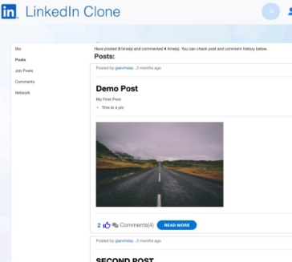

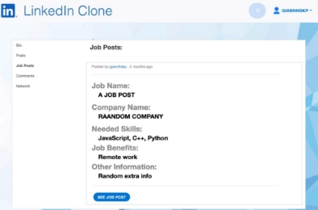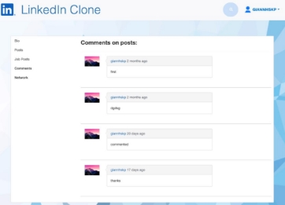

Προβολή Προφίλ Άλλων Χρηστών

Κάνοντας κλικ στο όνομα ενός άλλου χρήστη (το οποίο μπορούμε να συναντήσουμε σε πολλά σημεία της εφαρμογής) ο χρήστης κατευθύνεται στην προβολή του προφίλ του αντίστοιχου χρήστη.

Στην καρτέλα αυτή ο χρήστης μπορεί να δει την φωτογραφία προφίλ του άλλου χρήστη, στοιχεία όπως email και τηλέφωνο καθώς και τα προσωπικά στοιχεία του άλλου χρήστη όπως εκπαίδευση, εμπειρία και ικανότητες. Όσον αφορά τα στοιχεία του άλλου χρήστη, εμφανίζονται μόνο όσα έχουν τεθεί ως δημοσία, ενώ  όσα έχουν δηλωθεί ως ιδιωτικά αποκρύπτονται.

Επίσης από το αριστερό μέρος της σελίδας ο χρήστης μπορεί:

- Να δει και να διαχειριστεί την “κατάσταση φιλίας” μεταξύ τους, δηλαδή να στείλει αίτημα σύνδεσης, να αποδεχθεί αίτημα σύνδεσης κ.ο.κ
- Να δει το δίκτυο του άλλου χρήστη, δηλαδή όλους τους χρήστες οι οποίοι είναι συνδεδεμένοι με αυτόν (μόνο αν οι δύο χρήστες είναι συνδεδεμένοι).
- Να στείλει μήνυμα στον χρήστη (μόνο αν οι δύο χρήστες είναι συνδεδεμένοι).

Περισσότερα για το δίκτυο, για τη σύνδεση μεταξύ χρηστών και τα μηνύματα εξηγούνται στην συνέχεια στις παραγράφους [Δίκτυο - Network](#_page12_x56.69_y41.37), [Σύνδεση Μεταξύ Χρηστών](#_page9_x56.69_y41.37) και [Μηνύματα ](#_page16_x56.69_y41.37)αντίστοιχα.

Η εικόνα που συναντά ένας χρήστης προβάλλοντας το προφίλ ενός άλλου χρήστη είναι η εξής:

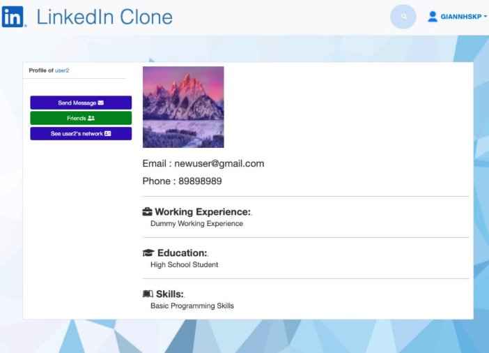

### Σύνδεση Μεταξύ Χρηστών

Δυο χρήστες μπορούν να συνδεθούν μεταξύ τους. Για να συνδεθούν πρέπει ένας από τους δύο χρήστες να στείλει αίτημα σύνδεσης στον άλλον και αντίστοιχα ο άλλος να αποδεχτεί το αίτημα σύνδεσης.

Ένας χρήστης που έχει στείλει αίτημα σύνδεσης σε έναν άλλο χρήστης και περιμένει αποδοχή, μπορεί να ακυρώσει το αίτημα του.

Έπειτα από την σύνδεση δύο χρηστών:

- Μπορούν να επικοινωνήσουν μεταξύ τους μέσω μηνυμάτων
- Τα άρθρα του ενός εμφανίζονται στην αρχική σελίδα του άλλου
- Ο ένας χρήστης μπορεί να δει το δίκτυο συνδεδεμένων χρηστών του άλλου
- Ο ένας χρήστης μπορεί να δει όλα τα προσωπικά στοιχεία του άλλου χρήστη τα οποία ενδεχομένως ήταν ιδιωτικά και δεν εμφανίζονταν πριν την σύνδεση τους.

Μέσω της καρτέλας προβολής προφίλ ενός άλλου χρήστη, ένας χρήστης μπορεί:

- Να στείλει αίτημα σύνδεσης σε έναν άλλον χρήστη
- Να ακυρώσει το αίτημα σύνδεσης, σε περίπτωση που έχει σταλεί ήδη και ο άλλος χρήστης δεν το έχει αποδεχτεί ακόμα.
- Να αποδεχτεί ή να απορρίψει το αίτημα σύνδεσης, σε περίπτωση που ο συγκεκριμένος χρήστης του έχει ήδη στείλει αίτημα σύνδεσης

Παρακάτω υπάρχουν οι αντίστοιχες εικόνες από την καρτέλα προβολής του προφίλ ενός άλλου χρήστη που αφορούν τα αιτήματα σύνδεσης.

Οι χρήστες giannhskp και user23 δεν είναι συνδεδεμένοι (ο giannhskp βλέπει το προφίλ του user23):

O giannhskp στέλνει αίτημα σύνδεσης στον user23.

Ο giannhskp βλέπει το προφίλ του user23:

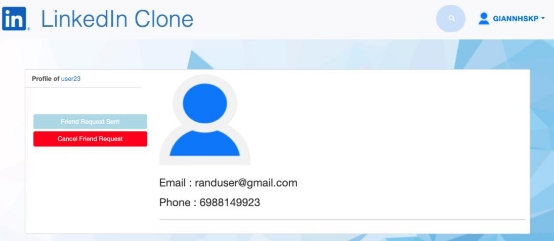

Ο user23 βλέπει το προφίλ του giannhskp (τα στοιχεία του giannhskp είναι public):

O user23 αποδέχεται το αίτημα σύνδεσης του giannhskp.

Πλέον ο giannhskp μπορεί να δει τα προσωπικά στοιχεία του user23 τα οποία ήταν ιδιωτικά και προηγουμένως δεν φαινόντουσαν, μπορεί να του στείλει μήνυμα και μπορεί να δει το δίκτυο συνδεδεμένων χρηστών του.

Προφανώς τα ίδια ισχύουν και αντίστροφα.

Πλέον η εικόνα που βλέπει ο giannhskp προβάλλοντας το προφίλ του user23 είναι η εξής:

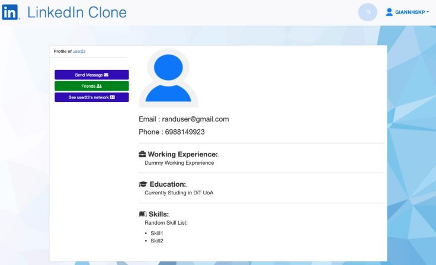

### Προβολή Αιτημάτων Σύνδεσης

Ένας χρήστης έχει την δυνατότητα να δει και να διαχειριστεί όλα τα αιτήματα σύνδεσης που έχει λάβει από άλλους χρήστες. Πιο συγκεκριμένα, επιλέγοντας την καρτέλα “Friend Requests” από το drop-down menu, ο χρήστης μεταφέρεται σε μια νέα καρτέλα από την οποία μπορεί να δει όλα τα αιτήματα σύνδεσης που έχει λάβει από άλλους χρήστες και κατ’ επέκταση να αποδεχθεί ή να απορρίψει κάθε ένα από αυτά τα αιτήματα.

Όταν ένα αίτημα γίνει αποδεκτό ή απορριφθεί από τον χρήστη, παύει να εμφανίζεται στην λίστα αιτημάτων.

Η εικόνα που έχει ο χρήστης στην καρτέλα Friend Requests είναι η εξής:

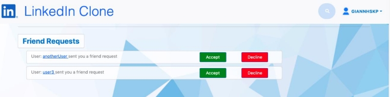

### Δίκτυο - Network

Επιλέγοντας την καρτέλα "Network" ο χρήστης κατευθύνεται στο δίκτυο του. Εκεί εμφανίζονται όλοι οι συνδεδεμένοι με αυτόν χρήστες. Για κάθε χρήστη, φαίνεται η εικόνα προφίλ του καθώς και τα προσωπικά του στοιχεία.

Πατώντας πάνω στο όνομα ενός χρήστη, γίνεται ανακατεύθυνση στην σελίδα προβολής του προφίλ αυτού του χρήστη.

Όπως έχει αναφερθεί και προηγουμένως, ένας χρήστης έχει την δυνατότητα να δει το δίκτυο ενός συνδεδεμένου με αυτόν χρήστη. Όντας στην σελίδα προβολής του προφίλ ενός άλλου χρήση και πατώντας το κουμπί “See … network” όπου στα αποσιωπητικά υπάρχει το όνομα του χρήστη του οποίο το προφίλ προβάλλεται, ο χρήστης μεταβαίνει στο δίκτυο του χρήστη αυτού. Έτσι βλέπει όλους τους συνδεδεμένους με αυτόν χρήστες και πατώντας πάνω στο όνομα τους μπορεί να κατευθυνθεί στο προφίλ τους μέσω του οποίου μπορεί να τους στείλει αίτημα σύνδεσης (αν δεν είναι ήδη συνδεδεμένοι) καθώς και οποιαδήποτε από τις άλλες λειτουργίες που έχουν ήδη αναφερθεί στις προηγούμενες παραγράφους: [Προβολή Προφίλ Άλλων Χρηστών](#_page8_x56.69_y41.37) και [Σύνδεση Μεταξύ Χρηστών](#_page9_x56.69_y41.37).

Ακολουθεί εικόνα από το δίκτυο του χρήστη giannhskp ο οποίος είναι συνδεδεμένος με δύο χρήστες, τους: user2 και user23.

### Αγγελίες - Job Posts

Επιλέγοντας την καρτέλα "Job Posts" ο χρήστης βλέπει όλες τις δημοσιευμένες αγγελίες εργασίας, είτε έχουν αναρτηθεί από συνδεδεμένους με αυτόν χρήστες είτε από μη συνδεδεμένους με αυτόν χρήστες.

Μια αγγελία περιέχει: το όνομα της θέσης/δουλειάς, το όνομα της εταιρείας, τις απαραίτητες δεξιότητες που πρέπει να έχουν οι αιτούντες, τα πλεονεκτήματα που προσφέρει η εργασία αυτή καθώς και οποιεσδήποτε επιπλέον πληροφορίες.

Οι χρήστες μπορούν να υποβάλουν αιτήσεις στις αγγελίες άλλων χρηστών ενώ ο χρήστης που ανάρτησε την αγγελία μπορεί να εξετάζει τις αιτήσεις που έχουν ληφθεί για κάθε δική του αγγελία.

Μέσω ενός κουμπιού στο δεξί μέρος της οθόνης ο χρήστης μπορεί να επιλέξει εάν θέλει να βλέπει μόνο τις δικές του αγγελίες (έτσι ώστε να ελέγξει τις αιτήσεις) ή αν θέλει να βλέπει όλες τις αγγελίες.

Η εικόνα που βλέπει ένας χρήστης στην καρτέλα Job Posts είναι η εξής:

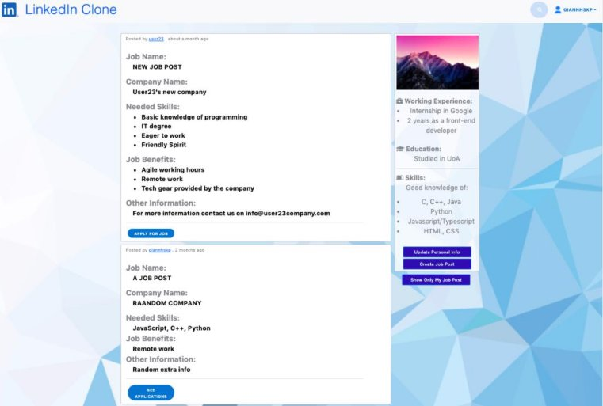

Αν η αγγελία έχει αναρτηθεί από τον ίδιο τον χρήστη τότε κάτω από την αγγελία εμφανίζεται το κουμπί “SEE APPLICATIONS”. Πατώντας το ο χρήστης μεταφέρεται σε νέα καρτέλα η οποία περιγράφεται στην παράγραφο [Προσωπικές Αγγελίες](#_page14_x56.69_y41.37).

Αν η αγγελία έχει αναρτηθεί από άλλο χρήστη τότε κάτω από την αγγελία εμφανίζεται το κουμπί “APPLY FOR JOB”. Πατώντας το ο χρήστης μεταφέρεται σε νέα καρτέλα η οποία περιγράφεται στην παράγραφο [Αγγελίες Άλλων Χρηστών](#_page15_x56.69_y41.37).

### Προσωπικές Αγγελίες

Όντας στην καρτέλα Job Posts, κάτω από τις αγγελίες που έχει αναρτήσει ο ίδιος ο χρήστης εμφανίζεται το κουμπί “SEE APPLICATIONS”. Πατώντας το, ο χρήστης μεταφέρεται στην καρτέλα προβολής της αγγελίας, μέσω της οποίας μπορεί να  δει όλες τις αιτήσεις οι οποίες έχουν ληφθεί από άλλους χρήστες για την συγκεκριμένη αγγελία.

Πιο συγκεκριμένα, η καρτέλα προβολής της αγγελίας είναι η εξής:

Πατώντας το κουμπί “SHOW JOB APPLICATIONS” μπορεί να δει όλες τις αιτήσεις. Οι αιτήσεις φαίνονται ως εξής:

### Αγγελίες Άλλων Χρηστών

Όντας στην καρτέλα Job Posts, κάτω από τις αγγελίες που έχουν αναρτήσει άλλοι χρήστες εμφανίζεται το κουμπί “APPLY FOR JOB”. Πατώντας το, ο χρήστης μεταφέρεται στην καρτέλα προβολής της αγγελίας, μέσω της οποίας μπορεί να να κάνει αίτηση για την συγκεκριμένη αγγελία. Την αίτηση αυτή μπορεί να την δεί μόνο ο χρήστης που ανάρτησε την αγγελία, όπως περιγράφεται στην αμέσως παραπάνω παράγραφο.

Πιο συγκεκριμένα, η καρτέλα προβολής της αγγελίας είναι η εξής:

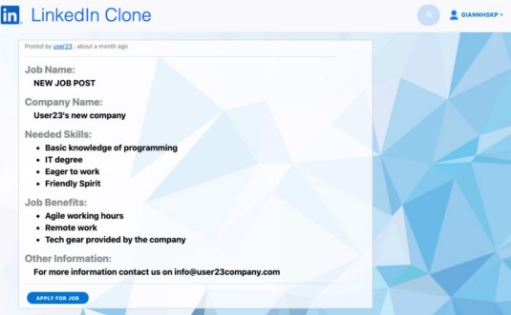

Πατώντας το κουμπί "APPLY FOR JOB", εμφανίζεται ένα πλαίσιο κειμένου μέσω του οποίου ο χρήστης μπορεί να γράψει το επιθυμητό κείμενο για την αίτηση του.

Στην συνέχεια πατώντας το κουμπί "APPLY" μπορεί να αποστείλει την αίτηση του, ενώ πατώντας το κουμπί “DISCARD” μπορεί να ακυρώσει την αίτηση και να αποκρύψει το πλαίσιο κειμένου.

Η φόρμα της αίτησης φαίνεται ως εξής:

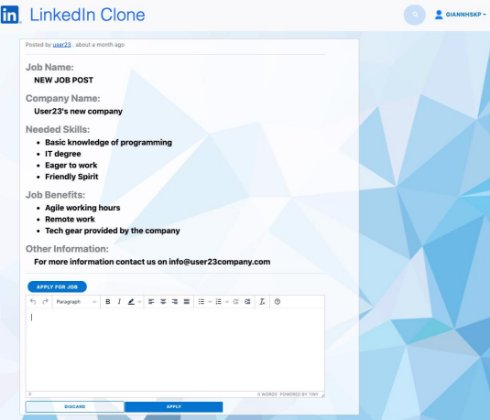

### Μηνύματα

Δυο χρήστες οι οποίοι είναι συνδεδεμένοι μεταξύ τους μπορούν να επικοινωνήσουν μέσω μηνυμάτων.

Αποστολή Μηνύματος Σε Άλλο Χρήστη

Όπως έχει ήδη αναφερθεί, όταν ένας χρήστης βρίσκεται στην καρτέλα προβολής του προφίλ ενός άλλου χρήστη και οι δύο αυτοί χρήστες είναι συνδεδεμένοι, στο δεξί μέρος της σελίδας εμφανίζεται το κουμπί “SEND MESSAGE”.

Πατώντας αυτό το κουμπί, ο χρήστης μεταφέρεται σε νέα καρτέλα μέσω της οποίας μπορεί να στείλει μήνυμα στον χρήστη αυτόν. Πιο συγκεκριμένα, στην νέα καρτέλα εμφανίζεται η ήδη υπάρχουσα συνομιλία μεταξύ των δύο χρηστών εάν αυτή υπάρχει. Αν οι δύο χρήστες δεν έχουν ανταλλάξει μηνύματα στο παρελθόν τότε εμφανίζεται μια κενή συνομιλία.

Τα μηνύματα της συνομιλίας εμφανίζονται με χρονολογική σειρά, με το νεότερο να βρίσκεται τελευταίο. Κάνοντας scroll προς τα πάνω εμφανίζονται και τα παλιότερα μηνύματα.

Τα μηνύματα τα οποία έχει στείλει ο τρέχων χρήστης βρίσκονται στα δεξιά με μπλε χρώμα ενώ τα μηνύματα τα οποία έχει στείλει ο άλλος χρήστης βρίσκονται στα αριστερά με ανοιχτό γαλάζιο χρώμα.

Κάτω από κάθε μήνυμα υπάρχει η σχετική πληροφορία για το πότε έχει σταλεί το συγκεκριμένο μήνυμα.

Στο κάτω μέρος της οθόνης υπάρχει ένα πλαίσιο κειμένου μέσω του οποίο ο χρήστης μπορεί να στείλει ένα νέο μήνυμα. Πληκτρολογώντας το επιθυμητό μήνυμα στο πλαίσιο και πατώντας το κουμπί “Send” μπορεί να στείλει ένα νέο μήνυμα.

Τα μηνύματα ανανεώνονται συνεχώς και έτσι μόλις ο χρήστης λάβει/στείλει ένα νέο μήνυμα, αυτό εμφανίζεται στην συνομιλία.

Η εικόνα που έχει ο χρήστης είναι η εξής:

### Συζητήσεις

Επιλέγοντας την καρτέλα "Messages" από το drop-down menu ο χρήστης μεταφέρεται σε μια νέα καρτέλα μέσω τις οποίας έχει πρόσβαση σε όλες τις πρόσφατες συνομιλίες που έχει κάνει με άλλους χρήστες.

Πιο συγκεκριμένα, στο αριστερό μέρος της σελίδας εμφανίζονται σε μορφή λίστας όλοι οι χρήστες με τους οποίους ο τρέχων χρήστης έχει συνομιλήσει στο παρελθόν. Οι χρήστες εμφανίζονται με ταξινομημένοι με βάση το πιο πρόσφατο μήνυμα της συνομιλίας τους. Δηλαδή, ο πρώτος που εμφανίζεται είναι αυτός με τον οποίο το τελευταίο μήνυμα της συνομιλίας είναι το πιο πρόσφατο μήνυμα το οποίο έχει στείλει/λάβει ο τρέχων χρήστης.

Επιλέγοντας έναν από αυτούς τους χρήστες, εμφανίζεται στο κεντρικό κομμάτι της σελίδας η μεταξύ τους συνομιλία. Ταυτόχρονα, το όνομα του επιλεγμένου χρήστη αλλάζει σε πράσινο χρώμα στην λίστα χρηστών που αναφέρθηκε προηγουμένως.

Η συνομιλία που εμφανίζεται είναι αντίστοιχη με αυτή που περιγράφηκε στην παράγραφο [Αποστολή Μηνύματος Σε Άλλο Χρήστη](#_page16_x56.69_y117.46), δηλαδή μέσω αυτής ο χρήστης μπορεί τόσο να δεί την ήδη υπάρχουσα συνομιλία όσο και να στείλει νέα μηνύματα.

Επιλέγοντας διαφορετικούς χρήστες από την λίστα χρηστών, η συνομιλία αλλάζει στην αντίστοιχη συνομιλία με τον επιλεγμένο χρήστη.

Επίσης η λίστα χρηστών ανανεώνεται συνεχώς όσο στέλνονται νέα μηνύματα, διατηρώντας έτσι την χρονολογική σειρά των χρηστών με βάση το τελευταίο μήνυμα του έχει σταλεί/ληφθεί στην κάθε συνομιλία.

Μια ενδεικτική εικόνα από την καρτέλα “Messages” είναι η εξής:

### Ειδοποιήσεις

Όπως έχει ήδη αναφερθεί οι χρήστες της εφαρμογής μπορούν να δηλώνουν το ενδιαφέρον τους και να σχολιάζουν άρθρα άλλων χρηστών.

Ένας χρήστης, επιλέγοντας την καρτέλα "Notifications" από το drop-down menu, μπορεί να δει ειδοποιήσεις σχετικά με τις δηλώσεις ενδιαφέροντος αλλά και τα σχόλια που έκαναν άλλοι χρήστες στα άρθρα του.

Πιο συγκεκριμένα, στην καρτέλα Notifications εμφανίζεται μια λίστα από ειδοποιήσεις. Μια ειδοποίηση μπορεί είτε να αφορά την δήλωση ενδιαφέροντος ενός χρήστη για ένα άρθρο είτε την προσθήκη ενός σχολίου από έναν χρήστη σε ένα άρθρο του τρέχοντος χρήστη.

Κάθε ειδοποίηση περιέχει πληροφορία για τον χρήστη τον οποίο έκανε το σχόλιο/δήλωση ενδιαφέροντος καθώς και για το άρθρο το οποίο αφορά η συγκεκριμένη ειδοποίηση. Πατώντας πάνω στο όνομα του χρήστη, γίνεται ανακατεύθυνση στην καρτέλα προβολής του προφίλ του χρήστη αυτού. Πατώντας στην λέξη “post”, γίνεται ανακατεύθυνση στην καρτέλα προβολής του άρθρου το οποίο αφορά η ειδοποίηση.

Στο δεξί μέρος της σελίδας υπάρχουν τρία κουμπιά τα οποία δίνουν την δυνατότητα στον χρήστη να προβάλει:

- Όλες τις ειδοποιήσεις
- Μονο τις ειδοποιήσεις που αφορούν δήλωση ενδιαφέροντος
- Μονο τις ειδοποιήσεις που αφορούν σχολιασμό ενός άρθρου

Τα κουμπιά φαίνονται ως εξής:

Μια ενδεικτική εικόνα από την καρτέλα ειδοποιήσεων είναι η εξής:

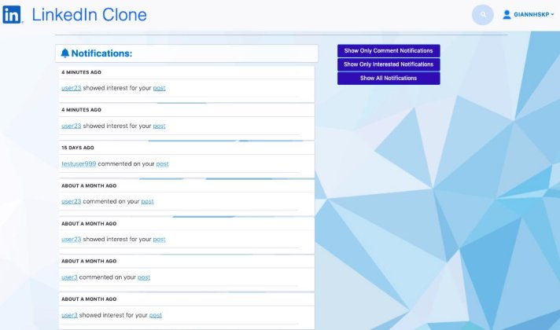

Για τις ειδοποιήσεις οι οποίες αφορούν αιτήματα σύνδεσης έχει δημιουργηθεί ξεχωριστή καρτέλα η οποία περιγράφεται στην παράγραφο [Προβολή Αιτημάτων Σύνδεσης](#_page11_x56.69_y41.37).

###Προσωπικά Στοιχεία

Επιλέγοντας την καρτέλα “Personal Info” από το drop-down menu ο χρήστης κατευθύνεται στην σελίδα επεξεργασίας των προσωπικών του στοιχείων.

Από εκεί μπορεί να εισάγει την επαγγελματική του εμπειρία, τις πληροφορίες σχετικά με την εκπαίδευσή του και τις δεξιότητές του.

Για κάθε μια από αυτές τις πληροφορίες μπορεί να επιλέξει εάν θα είναι δημόσια ή ιδιωτική.

Εάν μια πληροφορία είναι δημόσια, τότε οποιοσδήποτε χρήστης μπορεί να την δει ανεξαρτήτως αν είναι συνδεδεμένος μαζί του ή όχι.

Αντίθετα, αν μια πληροφορία έχει οριστεί ως ιδιωτική τότε μόνο οι συνδεδεμένοι με αυτόν χρήστες μπορούν να δουν την πληροφορία αυτή.

Στην σελίδα εμφανίζεται ένα πλαίσιο κειμένου για κάθε μία πληροφορία μέσω του οποίου ο χρήστης μπορεί να ορίσει την αντίστοιχη πληροφορία.

Επίσης, δεξιά από κάθε πλαίσιο κειμένου υπάρχει ένα drop-down menu μεσω του οποίου ο χρήστης επιλέγει αν η αντίστοιχη πληροφορία θα είναι ιδιωτική η δημόσια.

Τα κουμπιά έχουν την εξής μορφή ανάλογα με το αν ο χρήστης έχει επιλέξει να είναι δημόσια ή ιδιωτική μια πληροφορία:

Αν ο χρήστης θέλει να αλλάξει την επιλογή δημόσια/ιδιωτική, κάνει κλίκ στο αντίστοιχο κουμπί, εμφανίζεται το drop-down menu και επιλέγει την “αντίθετη” επιλογή. Η αλλαγή αποθηκεύεται αυτόματα και πλέον στο κουμπί εμφανίζεται η νέα επιλογή απορρήτου.

Η εικόνα που βλέπει ο χρήστης στην καρτέλα Personal Info είναι η εξής:

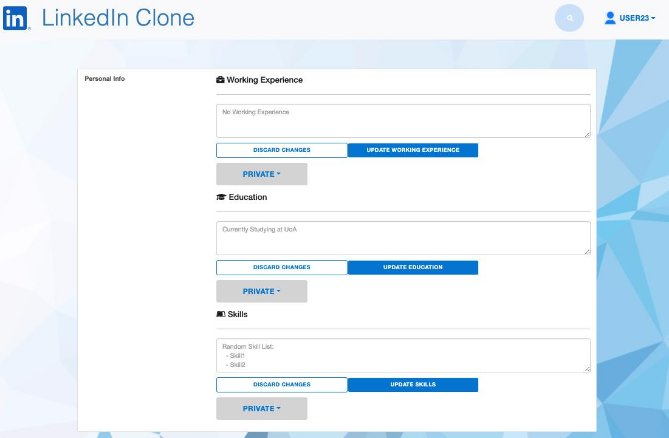

### Ρυθμίσεις

Επιλέγοντας την καρτέλα “Settings” από το drop-down menu ο χρήστης κατευθύνεται σε νέα καρτέλα μέσω της οποίας ο χρήστης μπορεί:

- Να αλλάξει την φωτογραφία προφίλ του
- Να αλλάξει το όνομα χρήστη του (username)
- Να αλλάξει το email του
- Να αλλάξει τον κωδικό του

Για την αλλαγή φωτογραφίας προφίλ, ο χρήστης ανεβάζει την επιθυμητή φωτογραφία μέσω του κουμπιού “Select New Photo” και αποθηκεύει την αλλαγή φωτογραφίας πατώντας το κουμπί "Upload".

Για την αλλαγή username ή email, ο χρήστης πληκτρολογεί το νέο username ή email στο αντίστοιχο πεδίο και αποθηκεύει την αλλαγή πατώντας το κουμπί "Save".

Για την αλλαγή κωδικού ο χρήστης πρέπει να πληκτρολογήσει τον νέο κωδικό τόσο στο πεδίο του νέου κωδικού όσο και στο πεδίο επιβεβαίωσης του κωδικού και τελικά να πραγματοποιήσει την αλλαγή κωδικού πατώντας το κουμπί “Save”. Αν οι δύο κωδικοί δεν είναι ίδιοι εμφανίζεται μήνυμα λάθους και η αλλαγή κωδικού δεν πραγματοποιείται.

Η εικόνα που βλέπει ο χρήστης στην καρτέλα Settings είναι η εξής:

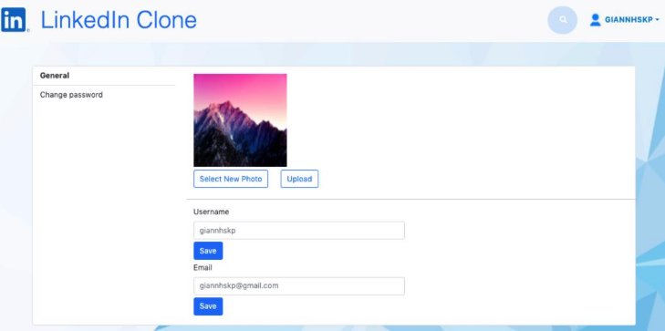

###Διαχειριστής Εφαρμογής

Ο ρόλος του διαχειριστή έχει οριστεί σε έναν χρήστη κατα την εγκατάσταση της εφαρμογής.

Ο διαχειριστής, κατά την σύνδεση του ανακατευθύνεται σε μία σελίδα (αντίστοιχη με αυτή του [Δίκτυο - Network](#_page12_x56.69_y41.37)) στην οποία εμφανίζονται σε μορφή λίστας όλοι οι εγγεγραμμένοι χρήστες της εφαρμογής.

Σε αυτήν την σελίδα μπορεί να μεταφερθεί και επιλέγοντας την καρτέλα User List από το drop-down menu (ή πατώντας το logo στο header της εφαρμογής) όπου στην περίπτωση του διαχειριστή εμφανίζει όλους τους χρήστες της εφαρμογής και όχι μόνο τους συνδεδεμένους με αυτόν χρήστες (όπως θα γινόταν για έναν κανονικό χρήστη).

Επιλέγοντας έναν χρήστη (και κάνοντας κλικ στο όνομα του), ο διαχειριστής ανακατευθύνεται στην σελίδα προβολής του προφίλ του χρήστη αυτού.

Από την σελίδα αυτή ο διαχειριστής μπορεί να δει όλες τις πληροφορίες σχετικά με τον χρήστη αυτόν. Πιο συγκεκριμένα βλέπει πληροφορίες όπως:

- Τα προσωπικά του στοιχεία (π.χ. email, τηλέφωνο)
- Την επαγγελματική του εμπειρία, τις πληροφορίες σχετικά με την εκπαίδευσή του και τις δεξιότητές του.
- Τα άρθρα και τις αγγελίες που έχει αναρτήσει.
- Τα σχόλια που έχει προσθέσει σε άρθρα.
- To δίκτυο του χρήστη.

Τέλος, μέσω των κουμπιών που εμφανίζονται στο αριστερό μέρος της οθόνης κατα την προβολή του προφίλ ενός χρήστη, ο διαχειριστής μπορεί να εξάγει όλες αυτές τις πληροφορίες σχετικά με αυτόν τον χρήστη τόσο σε μορφή XML όσο και σε JSON.

### Αποσύνδεση

Κάνοντας κλικ στην επιλογή "Logout" του drop-down menu, o χρήστης μπορεί να αποσυνδεθεί από την εφαρμογή.

Όταν ένας χρήστης αποσυνδέεται, διαγράφεται JSON Web Token το οποίο είχε λάβει κατά την σύνδεση του στην εφαρμογή. Έτσι, το JWT δεν μπορεί πλέον να χρησιμοποιηθεί για αιτήσεις στην εφαρμογή και κάθε αίτηση με αυτό το JWT απορρίπτεται.

Όταν ο χρήστης συνδεθεί ξανά στην εφαρμογή, τότε θα λάβει ένα νέο JWT μέσω του οποίοι θα πραγματοποιεί τις αιτήσεις στην εφαρμογή.

Έπειτα από την αποσύνδεση του χρήστη, ανακατευθύνεται στην Welcome Page.
=======
**ΤΕΧΝΟΛΟΓΙΕΣ ΕΦΑΡΜΟΓΩΝ ΔΙΑΔΙΚΤΥΟΥ ΕΡΓΑΣΙΑ ΕΑΡΙΝΟΥ ΕΞΑΜΗΝΟΥ 2021**

**Εφαρμογή Επαγγελματικής Δικτύωσης (τύπου LinkedIn)**

# Team  
[gianniskp](https://github.com/giannhskp)
[sitaras](https://github.com/Sitaras)

### Γενικά Σχόλια

- Για το back-end χρησιμοποιήσαμε Spring Boot.
- Για το front-end χρησιμοποιήσαμε Angular 5.
- Για την βάση δεδομένων χρησιμοποιήσαμε MySQL.
- Όλες οι αιτήσεις γίνονται χρησιμοποιώντας το πρωτόκολλο SSL/TLS. Στον φάκελο resources του back-end υπάρχει και το αντίστοιχο self-signed certificate (Java KeyStore file).
- Ο server (back-end) δέχεται αιτήσεις στο port 8443 (λόγω του ssl).
- Για να “τρέξει” το front-end εκτελούμε την εντολή: **ng serve --ssl true** έτσι ώστε να μπορούμε να χρησιμοποιήσουμε το πρωτόκολλο ssl/tls. Συνδεόμαστε στην εφαρμογή μέσω του browser στην διεύθυνση: **[https://localhost:4200**](https://localhost:4200)**

Πριν την πρώτη εκτέλεση του front-end χρειάζεται να εκτελεστεί η εντολή npm install έτσι ώστε να εγκατασταθούν όλα τα node-modules που χρησιμοποιούνται.

- **ΣΗΜΑΝΤΙΚΗ ΠΑΡΑΤΗΡΗΣΗ**: Λόγω του self-signed certificate, ενδεχομένως να χρειαστεί να πραγματοποιηθούν οι ακόλουθες δύο ενέργειες χωρίς τις οποίες ίσως να μην λειτουργεί η εφαρμογή:

- Κατά την πρόσβασή στην διεύθυνση **[https://localhost:4200**](https://localhost:4200)**, ενδεχομένως ο browser να προβάλει κάποια ειδοποίηση ασφαλείας την οποία και πρέπει να προσπεράσουμε πατώντας να συνεχίσουμε.
- Ανάλογα με τον browser που χρησιμοποιούμε ενδεχομένως να χρειαστεί να επιτρέψουμε εκ των προτέρων τα self-signed certificates. Διαφορετικά, για λόγους ασφαλείας η εφαρμογή ενδεχομένως να μην είναι λειτουργική.

Για παράδειγμα, σε Google Chrome, μπορούμε να επιτρέψουμε τα self-signed certificates πατώντας στο search bar :

chrome://flags/#allow-insecure-localhost

και ενεργοποιώντας την πρώτη επιλογή που εμφανίζεται.

- Για την διαχείριση/αποθήκευση των κωδικών πρόσβασης χρησιμοποιούμε κρυπτογράφηση μέσω του PasswordEncoder του spring security.
- Για το authentication ενός χρήστη κατα την σύνδεση του χρησιμοποιούμε τον Authentication Manager του spring security.
- Οι αιτήσεις έπειτα από την σύνδεση ενός χρήστη περιέχουν ένα JSON Web Token το οποίο ο χρήστης λαμβάνει κατα την σύνδεσή του και το οποίο ανανεώνεται κάθε φορά που λήγει. Μέσω του token ο χρήστης μπορεί να έχει πρόσβαση σε όλες τις προστατευόμενες καρτέλες της εφαρμογής στις οποίες δεν μπορεί να έχει πρόσβαση ένας μη συνδεδεμένος χρήστης.
- Ένας μη συνδεδεμένος χρήστης έχει πρόσβαση μόνο στο Welcome Page και αντίστοιχα στις καρτέλες σύνδεσης/εγγραφής. Κάθε προσπάθεια για αίτημα ενός μη συνδεδεμένου χρήστη σε οποιαδήποτε άλλη διεύθυνση απορρίπτεται..

### Welcome Page

Ανοίγοντας την αρχική σελίδα, στα δεξιά φαίνεται το λογότυπο της ιστοσελίδας καθώς και ένα μήνυμα καλωσορίσματος. Επίσης, μέσω του header της σελίδας, δίνεται στον χρήστη η δυνατότητα να εγγραφεί στην ιστοσελίδα δημιουργώντας έναν νέο λογαριασμό είτε να συνδεθεί με έναν ήδη υπάρχον λογαριασμό. Όλες οι αιτήσεις γίνονται μέσω του πρωτοκόλλου  SSL/TLS, περισσότερες λεπτομέρειες εξηγούνται στην συνέχεια.

Η “εικόνα” που συναντά ο χρήστης ανοίγοντας την σελίδα καλωσορίσματος είναι η εξής:

### Εγγραφή χρήστη

Πατώντας το κουμπί sign up, ο χρήστης μπορεί να δημιουργήσει έναν νέο λογαριασμό. Για την δημιουργία ενός νέου λογαριασμού απαιτείται η εισαγωγή ηλεκτρονικής διεύθυνσης email, όνομα χρήστη (username), κωδικός, επιβεβαίωση του κωδικού, όνομα, επώνυμο και φωτογραφία προφίλ. Το όνομα χρήστη καθώς και το email πρέπει να είναι μοναδικά, δηλαδή να μην υπάρχει ήδη κάποιος εγγεγραμμένος χρήστης με τα στοιχεία αυτά, διαφορετικά εμφανίζεται το αντίστοιχο μήνυμα λάθους. Η εισαγωγή φωτογραφίας προφίλ είναι προεραιτική κατα την εγγραφή, καθώς ο χρήστης μπορεί να την προσθέσει/αλλάξει και έπειτα από την εγγραφή του.

Σε κάθε περίπτωση επιτυχίας/αποτυχίας εγγραφής του χρήστη εμφανίζεται και το αντίστοιχο μήνυμα επιτυχίας/αποτυχίας.

Έπειτα από την επιτυχή εγγραφή ενός χρήστη, γίνεται ανακατεύθυνση στην σελίδα συνδεσης (login) έτσι ώστε να συνδεθεί.

Η εικόνα που συναντά ο χρήστης κατα την εγγραφή του είναι η εξής:

### Σύνδεση χρήστη

Για την σύνδεση ενός χρήστη, απαιτείται η εισαγωγή του email και του κωδικού του. Σε περίπτωση που εκχωρηθούν σωστά τότε ο χρήστης συνδέεται και ανακατευθύνεται στην αρχική σελίδα. Διαφορετικά, εμφανίζεται το αντίστοιχο μήνυμα λάθους και ο χρήστης πρέπει να εκχωρήσει ξανά τα στοιχεία του για να συνδεθεί.

Για την διαχείριση/αποθήκευση των κωδικών πρόσβασης χρησιμοποιείται κρυπτογράφηση. Πιο συγκεκριμένα, χρησιμοποιείται ο PasswordEncoder του spring security. Για το authentication του χρήστη κατα την σύνδεση του χρησιμοποιούμε τον Authentication Manager που επίσης παρέχεται από την βιβλιοθήκη του spring security.

Αφού συνδεθεί επιτυχώς ένας χρήστης, μέσω της απάντησης στο αίτημα σύνδεσης λαμβάνει ένα token το οποίο και χρησιμοποιεί για τις υπόλοιπες αιτήσεις του έπειτα από την σύνδεση. Πιο συγκεκριμένα λαμβάνει ένα μοναδικό JSON Web Token και μόνο μέσω αυτού ένας χρήστης μπορεί να έχει πρόσβαση στις υπηρεσίες της σελίδας. Το token αυτό λήγει έπειτα από ένα χρονικό διάστημα. Εάν λήξει, και ο συνδεδεμένος χρήστης κάνει μια νέα αίτηση τότε το token ανανεώνεται. Η εικόνα που συναντά ο χρήστης στην σελίδα σύνδεσης είναι η εξής:

### Αρχική Σελίδα

Αφού ένας χρήστης συνδεθεί επιτυχώς, ανακατευθύνεται στην αρχική σελίδα.

Η εικόνα που συναντά ακολουθεί στην συνέχεια. Κάθε ένα από τα αριθμημένα στοιχεία περιγράφεται στην συνέχεια.

Στην αρχική σελίδα εμφανίζονται με χρονολογική σειρά άρθρα τα οποία είτε έχουν αναρτηθεί από τον ίδιο τον χρήστη, είτε από κάποιον χρήστη ο οποίος είναι συνδεδεμένος με αυτόν, είτε άρθρα στα οποία έχει δηλώσει το ενδιαφέρον του κάποιος χρήστης από το δίκτυο του τρέχοντος χρήστη.

1. Ένα άρθρο κάποιου χρήστη χρήστη.
1. Πληροφορίες για το ποιός ανέβασε το συγκεκριμένο άρθρο καθώς και για το χρονικό διάστημα το οποίο ανέβηκε. Πατώντας πάνω στο όνομα του “συγγραφέα” γίνεται ανακατεύθυνση στο προφίλ του.
1. Ο τίτλος του άρθρου.
1. Το κείμενο/περιεχόμενο του άρθρου.
1. Ένα άρθρο μπορεί να περιέχει και φωτογραφία ή βίντεο, όπως φαίνεται και από το συγκεκριμένο άρθρο το οποίο περιέχει μια φωτογραφία. Ωστόσο μπορεί να μην περιέχει και τίποτα από τα δύο όπως φαίνεται στο αμέσως επόμενο άρθρο.
1. Ο αριθμός των ατόμων που έχουν δηλώσει το ενδιαφέρον τους για το συγκεκριμένο άρθρο.
7. Μέσω αυτού του κουμπιού ο χρήστης μπορεί να δηλώσει το ενδιαφέρον του για το συγκεκριμένο άρθρο. Πατώντας το κουμπί, αλλάζει σε πράσινο χρώμα δείχνοντας ότι έχει δηλωθεί ενδιαφέρον για αυτό το άρθρο, και προφανώς αυξάνεται ο αριθμός των ατόμων που έχουν δηλώσει ενδιαφέρον για το άρθρο. Αν ξανά πατηθεί το κουμπί τότε επιστρέφει στο αρχικό του χρώμα και αφαιρείται η δήλωση του ενδιαφέροντος, μειώνοντας έτσι τον αριθμό δηλώσεων ενδιαφέροντος του άρθρου κατά ένα.

8. Πατώντας αυτό το κουμπί ο χρήστης μπορεί να δει τα ήδη υπάρχοντα σχόλια του άρθρου καθώς και να προσθέσει δικά του σχόλια.
8. Πατώντας αυτό το κουμπί ο χρήστης ανακατευθύνεται σε νέα σελίδα η οποία περιέχει μόνο το συγκεκριμένο άρθρο και τα σχόλια του. Μέσω αυτής της σελίδας μπορεί και να σχολιάσει το άρθρο.
8. Η φωτογραφία προφίλ του χρήστη.
8. Τα προσωπικά στοιχεία του χρήστη, όπως : επαγγελματική εμπειρία, εκπαίδευση και δεξιότητες. Τα στοιχεία αυτά μπορούν να ενημερωθούν είτε μέσω του κουμπιού [12] είτε μέσω της καρτέλας “Προσωπικά Στοιχεία” (εξηγείται στην συνέχεια).
8. Πατώντας αυτό το κουμπί ο χρήστης ανακατευθύνεται στην καρτέλα “Προσωπικά Στοιχεία”. Περαιτέρω λεπτομέρειες εξηγούνται στην συνέχεια.
8. Πατώντας αυτό το κουμπί ο χρήστης ανακατευθύνεται σε μια νέα καρτέλα μέσω της οποίας μπορεί να ανεβάσει ένα νέο άρθρο. Για την συγγραφή ενός νέου άρθρου ο χρήστης πρέπει να εισάγει τον τίτλο του άρθρου το κείμενο/περιεχόμενο του και προεραιτικά κάποια φωτογραφία ή βίντεο.
8. Πλαίσιο εισόδου για αναζήτηση επαγγελματιών που έχουν εγγραφεί στην εφαρμογή. Η αναζήτηση γίνεται με βάση το όνομα χρήστη και εμφανίζονται όλοι οι χρήστες των οποίο το όνομα περιέχει την λέξη η οποία δόθηκε για αναζήτηση. Τα αποτελέσματα εμφανίζονται σε μορφή λίστας και πατώντας στο όνομα ενός χρήστη γίνεται ανακατεύθυνση στο προφίλ του.
8. Αρχικά φαίνεται το όνομα του χρήστη. Πατώντας πάνω, εμφανίζεται ένα drop down menu μέσω του οποίου η χρήστης μπορεί να πλοηγηθεί στις αντίστοιχες καρτέλες.

Κάθε μία από τις καρτέλες εξηγείται στην συνέχεια.

Το menu έχει την εξής μορφή:

### Προβολή Προφίλ

Προβολή Προσωπικού Προφίλ

Επιλέγοντας την καρτέλα "Profile" από το drop-down menu ο χρήστης κατευθύνεται στην προβολή του προσωπικού του προφίλ. Από εκεί μπορεί να δει όλα τα προσωπικά του στοιχεία, πληροφορίες για το πόσα άρθρα έχει αναρτήσει αλλά και για το πόσα σχόλια έχει προσθέσει σε άρθρα και τέλος μπορεί να δει όλα τα άρθρα που έχει αναρτήσει, όλες τις αγγελίες τις οποίες έχει αναρτήσει καθώς και όλα τα σχόλια τα οποία έχει κάνει σε άρθρα.

Προβολή Προφίλ Άλλων Χρηστών

Κάνοντας κλικ στο όνομα ενός άλλου χρήστη (το οποίο μπορούμε να συναντήσουμε σε πολλά σημεία της εφαρμογής) ο χρήστης κατευθύνεται στην προβολή του προφίλ του αντίστοιχου χρήστη.

Στην καρτέλα αυτή ο χρήστης μπορεί να δει την φωτογραφία προφίλ του άλλου χρήστη, στοιχεία όπως email και τηλέφωνο καθώς και τα προσωπικά στοιχεία του άλλου χρήστη όπως εκπαίδευση, εμπειρία και ικανότητες. Όσον αφορά τα στοιχεία του άλλου χρήστη, εμφανίζονται μόνο όσα έχουν τεθεί ως δημοσία, ενώ  όσα έχουν δηλωθεί ως ιδιωτικά αποκρύπτονται.

Επίσης από το αριστερό μέρος της σελίδας ο χρήστης μπορεί:

- Να δει και να διαχειριστεί την “κατάσταση φιλίας” μεταξύ τους, δηλαδή να στείλει αίτημα σύνδεσης, να αποδεχθεί αίτημα σύνδεσης κ.ο.κ
- Να δει το δίκτυο του άλλου χρήστη, δηλαδή όλους τους χρήστες οι οποίοι είναι συνδεδεμένοι με αυτόν (μόνο αν οι δύο χρήστες είναι συνδεδεμένοι).
- Να στείλει μήνυμα στον χρήστη (μόνο αν οι δύο χρήστες είναι συνδεδεμένοι).

Περισσότερα για το δίκτυο, για τη σύνδεση μεταξύ χρηστών και τα μηνύματα εξηγούνται στην συνέχεια στις παραγράφους [Δίκτυο - Network](#_page12_x56.69_y41.37), [Σύνδεση Μεταξύ Χρηστών](#_page9_x56.69_y41.37) και [Μηνύματα ](#_page16_x56.69_y41.37)αντίστοιχα.

Η εικόνα που συναντά ένας χρήστης προβάλλοντας το προφίλ ενός άλλου χρήστη είναι η εξής:

### Σύνδεση Μεταξύ Χρηστών

Δυο χρήστες μπορούν να συνδεθούν μεταξύ τους. Για να συνδεθούν πρέπει ένας από τους δύο χρήστες να στείλει αίτημα σύνδεσης στον άλλον και αντίστοιχα ο άλλος να αποδεχτεί το αίτημα σύνδεσης.

Ένας χρήστης που έχει στείλει αίτημα σύνδεσης σε έναν άλλο χρήστης και περιμένει αποδοχή, μπορεί να ακυρώσει το αίτημα του.

Έπειτα από την σύνδεση δύο χρηστών:

- Μπορούν να επικοινωνήσουν μεταξύ τους μέσω μηνυμάτων
- Τα άρθρα του ενός εμφανίζονται στην αρχική σελίδα του άλλου
- Ο ένας χρήστης μπορεί να δει το δίκτυο συνδεδεμένων χρηστών του άλλου
- Ο ένας χρήστης μπορεί να δει όλα τα προσωπικά στοιχεία του άλλου χρήστη τα οποία ενδεχομένως ήταν ιδιωτικά και δεν εμφανίζονταν πριν την σύνδεση τους.

Μέσω της καρτέλας προβολής προφίλ ενός άλλου χρήστη, ένας χρήστης μπορεί:

- Να στείλει αίτημα σύνδεσης σε έναν άλλον χρήστη
- Να ακυρώσει το αίτημα σύνδεσης, σε περίπτωση που έχει σταλεί ήδη και ο άλλος χρήστης δεν το έχει αποδεχτεί ακόμα.
- Να αποδεχτεί ή να απορρίψει το αίτημα σύνδεσης, σε περίπτωση που ο συγκεκριμένος χρήστης του έχει ήδη στείλει αίτημα σύνδεσης

Παρακάτω υπάρχουν οι αντίστοιχες εικόνες από την καρτέλα προβολής του προφίλ ενός άλλου χρήστη που αφορούν τα αιτήματα σύνδεσης.

Οι χρήστες giannhskp και user23 δεν είναι συνδεδεμένοι (ο giannhskp βλέπει το προφίλ του user23):

O giannhskp στέλνει αίτημα σύνδεσης στον user23.

Ο giannhskp βλέπει το προφίλ του user23:

Ο user23 βλέπει το προφίλ του giannhskp (τα στοιχεία του giannhskp είναι public):

O user23 αποδέχεται το αίτημα σύνδεσης του giannhskp.

Πλέον ο giannhskp μπορεί να δει τα προσωπικά στοιχεία του user23 τα οποία ήταν ιδιωτικά και προηγουμένως δεν φαινόντουσαν, μπορεί να του στείλει μήνυμα και μπορεί να δει το δίκτυο συνδεδεμένων χρηστών του.

Προφανώς τα ίδια ισχύουν και αντίστροφα.

Πλέον η εικόνα που βλέπει ο giannhskp προβάλλοντας το προφίλ του user23 είναι η εξής:

### Προβολή Αιτημάτων Σύνδεσης

Ένας χρήστης έχει την δυνατότητα να δει και να διαχειριστεί όλα τα αιτήματα σύνδεσης που έχει λάβει από άλλους χρήστες. Πιο συγκεκριμένα, επιλέγοντας την καρτέλα “Friend Requests” από το drop-down menu, ο χρήστης μεταφέρεται σε μια νέα καρτέλα από την οποία μπορεί να δει όλα τα αιτήματα σύνδεσης που έχει λάβει από άλλους χρήστες και κατ’ επέκταση να αποδεχθεί ή να απορρίψει κάθε ένα από αυτά τα αιτήματα.

Όταν ένα αίτημα γίνει αποδεκτό ή απορριφθεί από τον χρήστη, παύει να εμφανίζεται στην λίστα αιτημάτων.

Η εικόνα που έχει ο χρήστης στην καρτέλα Friend Requests είναι η εξής:

### Δίκτυο - Network

Επιλέγοντας την καρτέλα "Network" ο χρήστης κατευθύνεται στο δίκτυο του. Εκεί εμφανίζονται όλοι οι συνδεδεμένοι με αυτόν χρήστες. Για κάθε χρήστη, φαίνεται η εικόνα προφίλ του καθώς και τα προσωπικά του στοιχεία.

Πατώντας πάνω στο όνομα ενός χρήστη, γίνεται ανακατεύθυνση στην σελίδα προβολής του προφίλ αυτού του χρήστη.

Όπως έχει αναφερθεί και προηγουμένως, ένας χρήστης έχει την δυνατότητα να δει το δίκτυο ενός συνδεδεμένου με αυτόν χρήστη. Όντας στην σελίδα προβολής του προφίλ ενός άλλου χρήση και πατώντας το κουμπί “See … network” όπου στα αποσιωπητικά υπάρχει το όνομα του χρήστη του οποίο το προφίλ προβάλλεται, ο χρήστης μεταβαίνει στο δίκτυο του χρήστη αυτού. Έτσι βλέπει όλους τους συνδεδεμένους με αυτόν χρήστες και πατώντας πάνω στο όνομα τους μπορεί να κατευθυνθεί στο προφίλ τους μέσω του οποίου μπορεί να τους στείλει αίτημα σύνδεσης (αν δεν είναι ήδη συνδεδεμένοι) καθώς και οποιαδήποτε από τις άλλες λειτουργίες που έχουν ήδη αναφερθεί στις προηγούμενες παραγράφους: [Προβολή Προφίλ Άλλων Χρηστών](#_page8_x56.69_y41.37) και [Σύνδεση Μεταξύ Χρηστών](#_page9_x56.69_y41.37).

Ακολουθεί εικόνα από το δίκτυο του χρήστη giannhskp ο οποίος είναι συνδεδεμένος με δύο χρήστες, τους: user2 και user23.

### Αγγελίες - Job Posts

Επιλέγοντας την καρτέλα "Job Posts" ο χρήστης βλέπει όλες τις δημοσιευμένες αγγελίες εργασίας, είτε έχουν αναρτηθεί από συνδεδεμένους με αυτόν χρήστες είτε από μη συνδεδεμένους με αυτόν χρήστες.

Μια αγγελία περιέχει: το όνομα της θέσης/δουλειάς, το όνομα της εταιρείας, τις απαραίτητες δεξιότητες που πρέπει να έχουν οι αιτούντες, τα πλεονεκτήματα που προσφέρει η εργασία αυτή καθώς και οποιεσδήποτε επιπλέον πληροφορίες.

Οι χρήστες μπορούν να υποβάλουν αιτήσεις στις αγγελίες άλλων χρηστών ενώ ο χρήστης που ανάρτησε την αγγελία μπορεί να εξετάζει τις αιτήσεις που έχουν ληφθεί για κάθε δική του αγγελία.

Μέσω ενός κουμπιού στο δεξί μέρος της οθόνης ο χρήστης μπορεί να επιλέξει εάν θέλει να βλέπει μόνο τις δικές του αγγελίες (έτσι ώστε να ελέγξει τις αιτήσεις) ή αν θέλει να βλέπει όλες τις αγγελίες.

Η εικόνα που βλέπει ένας χρήστης στην καρτέλα Job Posts είναι η εξής:

Αν η αγγελία έχει αναρτηθεί από τον ίδιο τον χρήστη τότε κάτω από την αγγελία εμφανίζεται το κουμπί “SEE APPLICATIONS”. Πατώντας το ο χρήστης μεταφέρεται σε νέα καρτέλα η οποία περιγράφεται στην παράγραφο [Προσωπικές Αγγελίες](#_page14_x56.69_y41.37).

Αν η αγγελία έχει αναρτηθεί από άλλο χρήστη τότε κάτω από την αγγελία εμφανίζεται το κουμπί “APPLY FOR JOB”. Πατώντας το ο χρήστης μεταφέρεται σε νέα καρτέλα η οποία περιγράφεται στην παράγραφο [Αγγελίες Άλλων Χρηστών](#_page15_x56.69_y41.37).

### Προσωπικές Αγγελίες

Όντας στην καρτέλα Job Posts, κάτω από τις αγγελίες που έχει αναρτήσει ο ίδιος ο χρήστης εμφανίζεται το κουμπί “SEE APPLICATIONS”. Πατώντας το, ο χρήστης μεταφέρεται στην καρτέλα προβολής της αγγελίας, μέσω της οποίας μπορεί να  δει όλες τις αιτήσεις οι οποίες έχουν ληφθεί από άλλους χρήστες για την συγκεκριμένη αγγελία.

Πιο συγκεκριμένα, η καρτέλα προβολής της αγγελίας είναι η εξής:

Πατώντας το κουμπί “SHOW JOB APPLICATIONS” μπορεί να δει όλες τις αιτήσεις. Οι αιτήσεις φαίνονται ως εξής:

### Αγγελίες Άλλων Χρηστών

Όντας στην καρτέλα Job Posts, κάτω από τις αγγελίες που έχουν αναρτήσει άλλοι χρήστες εμφανίζεται το κουμπί “APPLY FOR JOB”. Πατώντας το, ο χρήστης μεταφέρεται στην καρτέλα προβολής της αγγελίας, μέσω της οποίας μπορεί να να κάνει αίτηση για την συγκεκριμένη αγγελία. Την αίτηση αυτή μπορεί να την δεί μόνο ο χρήστης που ανάρτησε την αγγελία, όπως περιγράφεται στην αμέσως παραπάνω παράγραφο.

Πιο συγκεκριμένα, η καρτέλα προβολής της αγγελίας είναι η εξής:

Πατώντας το κουμπί "APPLY FOR JOB", εμφανίζεται ένα πλαίσιο κειμένου μέσω του οποίου ο χρήστης μπορεί να γράψει το επιθυμητό κείμενο για την αίτηση του.

Στην συνέχεια πατώντας το κουμπί "APPLY" μπορεί να αποστείλει την αίτηση του, ενώ πατώντας το κουμπί “DISCARD” μπορεί να ακυρώσει την αίτηση και να αποκρύψει το πλαίσιο κειμένου.

Η φόρμα της αίτησης φαίνεται ως εξής:

### Μηνύματα

Δυο χρήστες οι οποίοι είναι συνδεδεμένοι μεταξύ τους μπορούν να επικοινωνήσουν μέσω μηνυμάτων.

Αποστολή Μηνύματος Σε Άλλο Χρήστη

Όπως έχει ήδη αναφερθεί, όταν ένας χρήστης βρίσκεται στην καρτέλα προβολής του προφίλ ενός άλλου χρήστη και οι δύο αυτοί χρήστες είναι συνδεδεμένοι, στο δεξί μέρος της σελίδας εμφανίζεται το κουμπί “SEND MESSAGE”.

Πατώντας αυτό το κουμπί, ο χρήστης μεταφέρεται σε νέα καρτέλα μέσω της οποίας μπορεί να στείλει μήνυμα στον χρήστη αυτόν. Πιο συγκεκριμένα, στην νέα καρτέλα εμφανίζεται η ήδη υπάρχουσα συνομιλία μεταξύ των δύο χρηστών εάν αυτή υπάρχει. Αν οι δύο χρήστες δεν έχουν ανταλλάξει μηνύματα στο παρελθόν τότε εμφανίζεται μια κενή συνομιλία.

Τα μηνύματα της συνομιλίας εμφανίζονται με χρονολογική σειρά, με το νεότερο να βρίσκεται τελευταίο. Κάνοντας scroll προς τα πάνω εμφανίζονται και τα παλιότερα μηνύματα.

Τα μηνύματα τα οποία έχει στείλει ο τρέχων χρήστης βρίσκονται στα δεξιά με μπλε χρώμα ενώ τα μηνύματα τα οποία έχει στείλει ο άλλος χρήστης βρίσκονται στα αριστερά με ανοιχτό γαλάζιο χρώμα.

Κάτω από κάθε μήνυμα υπάρχει η σχετική πληροφορία για το πότε έχει σταλεί το συγκεκριμένο μήνυμα.

Στο κάτω μέρος της οθόνης υπάρχει ένα πλαίσιο κειμένου μέσω του οποίο ο χρήστης μπορεί να στείλει ένα νέο μήνυμα. Πληκτρολογώντας το επιθυμητό μήνυμα στο πλαίσιο και πατώντας το κουμπί “Send” μπορεί να στείλει ένα νέο μήνυμα.

Τα μηνύματα ανανεώνονται συνεχώς και έτσι μόλις ο χρήστης λάβει/στείλει ένα νέο μήνυμα, αυτό εμφανίζεται στην συνομιλία.

Η εικόνα που έχει ο χρήστης είναι η εξής:

### Συζητήσεις

Επιλέγοντας την καρτέλα "Messages" από το drop-down menu ο χρήστης μεταφέρεται σε μια νέα καρτέλα μέσω τις οποίας έχει πρόσβαση σε όλες τις πρόσφατες συνομιλίες που έχει κάνει με άλλους χρήστες.

Πιο συγκεκριμένα, στο αριστερό μέρος της σελίδας εμφανίζονται σε μορφή λίστας όλοι οι χρήστες με τους οποίους ο τρέχων χρήστης έχει συνομιλήσει στο παρελθόν. Οι χρήστες εμφανίζονται με ταξινομημένοι με βάση το πιο πρόσφατο μήνυμα της συνομιλίας τους. Δηλαδή, ο πρώτος που εμφανίζεται είναι αυτός με τον οποίο το τελευταίο μήνυμα της συνομιλίας είναι το πιο πρόσφατο μήνυμα το οποίο έχει στείλει/λάβει ο τρέχων χρήστης.

Επιλέγοντας έναν από αυτούς τους χρήστες, εμφανίζεται στο κεντρικό κομμάτι της σελίδας η μεταξύ τους συνομιλία. Ταυτόχρονα, το όνομα του επιλεγμένου χρήστη αλλάζει σε πράσινο χρώμα στην λίστα χρηστών που αναφέρθηκε προηγουμένως.

Η συνομιλία που εμφανίζεται είναι αντίστοιχη με αυτή που περιγράφηκε στην παράγραφο [Αποστολή Μηνύματος Σε Άλλο Χρήστη](#_page16_x56.69_y117.46), δηλαδή μέσω αυτής ο χρήστης μπορεί τόσο να δεί την ήδη υπάρχουσα συνομιλία όσο και να στείλει νέα μηνύματα.

Επιλέγοντας διαφορετικούς χρήστες από την λίστα χρηστών, η συνομιλία αλλάζει στην αντίστοιχη συνομιλία με τον επιλεγμένο χρήστη.

Επίσης η λίστα χρηστών ανανεώνεται συνεχώς όσο στέλνονται νέα μηνύματα, διατηρώντας έτσι την χρονολογική σειρά των χρηστών με βάση το τελευταίο μήνυμα του έχει σταλεί/ληφθεί στην κάθε συνομιλία.

Μια ενδεικτική εικόνα από την καρτέλα “Messages” είναι η εξής:

### Ειδοποιήσεις

Όπως έχει ήδη αναφερθεί οι χρήστες της εφαρμογής μπορούν να δηλώνουν το ενδιαφέρον τους και να σχολιάζουν άρθρα άλλων χρηστών.

Ένας χρήστης, επιλέγοντας την καρτέλα "Notifications" από το drop-down menu, μπορεί να δει ειδοποιήσεις σχετικά με τις δηλώσεις ενδιαφέροντος αλλά και τα σχόλια που έκαναν άλλοι χρήστες στα άρθρα του.

Πιο συγκεκριμένα, στην καρτέλα Notifications εμφανίζεται μια λίστα από ειδοποιήσεις. Μια ειδοποίηση μπορεί είτε να αφορά την δήλωση ενδιαφέροντος ενός χρήστη για ένα άρθρο είτε την προσθήκη ενός σχολίου από έναν χρήστη σε ένα άρθρο του τρέχοντος χρήστη.

Κάθε ειδοποίηση περιέχει πληροφορία για τον χρήστη τον οποίο έκανε το σχόλιο/δήλωση ενδιαφέροντος καθώς και για το άρθρο το οποίο αφορά η συγκεκριμένη ειδοποίηση. Πατώντας πάνω στο όνομα του χρήστη, γίνεται ανακατεύθυνση στην καρτέλα προβολής του προφίλ του χρήστη αυτού. Πατώντας στην λέξη “post”, γίνεται ανακατεύθυνση στην καρτέλα προβολής του άρθρου το οποίο αφορά η ειδοποίηση.

Στο δεξί μέρος της σελίδας υπάρχουν τρία κουμπιά τα οποία δίνουν την δυνατότητα στον χρήστη να προβάλει:

- Όλες τις ειδοποιήσεις
- Μονο τις ειδοποιήσεις που αφορούν δήλωση ενδιαφέροντος
- Μονο τις ειδοποιήσεις που αφορούν σχολιασμό ενός άρθρου

Τα κουμπιά φαίνονται ως εξής:

Μια ενδεικτική εικόνα από την καρτέλα ειδοποιήσεων είναι η εξής:

Για τις ειδοποιήσεις οι οποίες αφορούν αιτήματα σύνδεσης έχει δημιουργηθεί ξεχωριστή καρτέλα η οποία περιγράφεται στην παράγραφο [Προβολή Αιτημάτων Σύνδεσης](#_page11_x56.69_y41.37).

###Προσωπικά Στοιχεία

Επιλέγοντας την καρτέλα “Personal Info” από το drop-down menu ο χρήστης κατευθύνεται στην σελίδα επεξεργασίας των προσωπικών του στοιχείων.

Από εκεί μπορεί να εισάγει την επαγγελματική του εμπειρία, τις πληροφορίες σχετικά με την εκπαίδευσή του και τις δεξιότητές του.

Για κάθε μια από αυτές τις πληροφορίες μπορεί να επιλέξει εάν θα είναι δημόσια ή ιδιωτική.

Εάν μια πληροφορία είναι δημόσια, τότε οποιοσδήποτε χρήστης μπορεί να την δει ανεξαρτήτως αν είναι συνδεδεμένος μαζί του ή όχι.

Αντίθετα, αν μια πληροφορία έχει οριστεί ως ιδιωτική τότε μόνο οι συνδεδεμένοι με αυτόν χρήστες μπορούν να δουν την πληροφορία αυτή.

Στην σελίδα εμφανίζεται ένα πλαίσιο κειμένου για κάθε μία πληροφορία μέσω του οποίου ο χρήστης μπορεί να ορίσει την αντίστοιχη πληροφορία.

Επίσης, δεξιά από κάθε πλαίσιο κειμένου υπάρχει ένα drop-down menu μεσω του οποίου ο χρήστης επιλέγει αν η αντίστοιχη πληροφορία θα είναι ιδιωτική η δημόσια.

Τα κουμπιά έχουν την εξής μορφή ανάλογα με το αν ο χρήστης έχει επιλέξει να είναι δημόσια ή ιδιωτική μια πληροφορία:

Αν ο χρήστης θέλει να αλλάξει την επιλογή δημόσια/ιδιωτική, κάνει κλίκ στο αντίστοιχο κουμπί, εμφανίζεται το drop-down menu και επιλέγει την “αντίθετη” επιλογή. Η αλλαγή αποθηκεύεται αυτόματα και πλέον στο κουμπί εμφανίζεται η νέα επιλογή απορρήτου.

Η εικόνα που βλέπει ο χρήστης στην καρτέλα Personal Info είναι η εξής:

### Ρυθμίσεις

Επιλέγοντας την καρτέλα “Settings” από το drop-down menu ο χρήστης κατευθύνεται σε νέα καρτέλα μέσω της οποίας ο χρήστης μπορεί:

- Να αλλάξει την φωτογραφία προφίλ του
- Να αλλάξει το όνομα χρήστη του (username)
- Να αλλάξει το email του
- Να αλλάξει τον κωδικό του

Για την αλλαγή φωτογραφίας προφίλ, ο χρήστης ανεβάζει την επιθυμητή φωτογραφία μέσω του κουμπιού “Select New Photo” και αποθηκεύει την αλλαγή φωτογραφίας πατώντας το κουμπί "Upload".

Για την αλλαγή username ή email, ο χρήστης πληκτρολογεί το νέο username ή email στο αντίστοιχο πεδίο και αποθηκεύει την αλλαγή πατώντας το κουμπί "Save".

Για την αλλαγή κωδικού ο χρήστης πρέπει να πληκτρολογήσει τον νέο κωδικό τόσο στο πεδίο του νέου κωδικού όσο και στο πεδίο επιβεβαίωσης του κωδικού και τελικά να πραγματοποιήσει την αλλαγή κωδικού πατώντας το κουμπί “Save”. Αν οι δύο κωδικοί δεν είναι ίδιοι εμφανίζεται μήνυμα λάθους και η αλλαγή κωδικού δεν πραγματοποιείται.

Η εικόνα που βλέπει ο χρήστης στην καρτέλα Settings είναι η εξής:

###Διαχειριστής Εφαρμογής

Ο ρόλος του διαχειριστή έχει οριστεί σε έναν χρήστη κατα την εγκατάσταση της εφαρμογής.

Ο διαχειριστής, κατά την σύνδεση του ανακατευθύνεται σε μία σελίδα (αντίστοιχη με αυτή του [Δίκτυο - Network](#_page12_x56.69_y41.37)) στην οποία εμφανίζονται σε μορφή λίστας όλοι οι εγγεγραμμένοι χρήστες της εφαρμογής.

Σε αυτήν την σελίδα μπορεί να μεταφερθεί και επιλέγοντας την καρτέλα User List από το drop-down menu (ή πατώντας το logo στο header της εφαρμογής) όπου στην περίπτωση του διαχειριστή εμφανίζει όλους τους χρήστες της εφαρμογής και όχι μόνο τους συνδεδεμένους με αυτόν χρήστες (όπως θα γινόταν για έναν κανονικό χρήστη).

Επιλέγοντας έναν χρήστη (και κάνοντας κλικ στο όνομα του), ο διαχειριστής ανακατευθύνεται στην σελίδα προβολής του προφίλ του χρήστη αυτού.

Από την σελίδα αυτή ο διαχειριστής μπορεί να δει όλες τις πληροφορίες σχετικά με τον χρήστη αυτόν. Πιο συγκεκριμένα βλέπει πληροφορίες όπως:

- Τα προσωπικά του στοιχεία (π.χ. email, τηλέφωνο)
- Την επαγγελματική του εμπειρία, τις πληροφορίες σχετικά με την εκπαίδευσή του και τις δεξιότητές του.
- Τα άρθρα και τις αγγελίες που έχει αναρτήσει.
- Τα σχόλια που έχει προσθέσει σε άρθρα.
- To δίκτυο του χρήστη.

Τέλος, μέσω των κουμπιών που εμφανίζονται στο αριστερό μέρος της οθόνης κατα την προβολή του προφίλ ενός χρήστη, ο διαχειριστής μπορεί να εξάγει όλες αυτές τις πληροφορίες σχετικά με αυτόν τον χρήστη τόσο σε μορφή XML όσο και σε JSON.

### Αποσύνδεση

Κάνοντας κλικ στην επιλογή "Logout" του drop-down menu, o χρήστης μπορεί να αποσυνδεθεί από την εφαρμογή.

Όταν ένας χρήστης αποσυνδέεται, διαγράφεται JSON Web Token το οποίο είχε λάβει κατά την σύνδεση του στην εφαρμογή. Έτσι, το JWT δεν μπορεί πλέον να χρησιμοποιηθεί για αιτήσεις στην εφαρμογή και κάθε αίτηση με αυτό το JWT απορρίπτεται.

Όταν ο χρήστης συνδεθεί ξανά στην εφαρμογή, τότε θα λάβει ένα νέο JWT μέσω του οποίοι θα πραγματοποιεί τις αιτήσεις στην εφαρμογή.

Έπειτα από την αποσύνδεση του χρήστη, ανακατευθύνεται στην Welcome Page.
>>>>>>> c1b4bbc1db9a07219b1e26f622408ed6c18e0f1b
